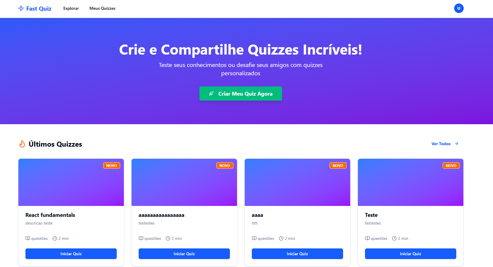
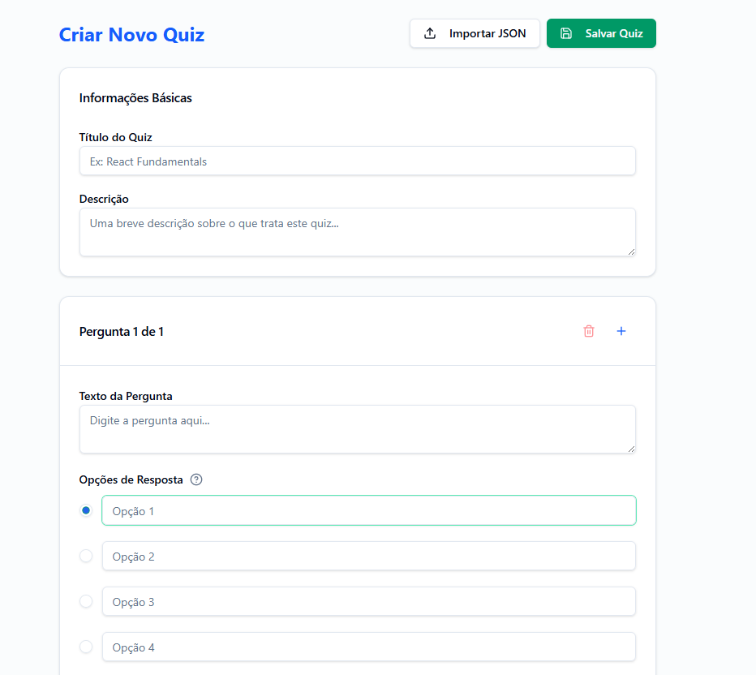

# Fast Quiz

Plataforma moderna para **criar, compartilhar e responder quizzes** de forma rapida e intuitiva. Construida com React, TypeScript e shadcn/ui seguindo Atomic Design.

## Screenshots

### Pagina Inicial


### Criar Quiz


## Tech Stack

| Camada | Tecnologia |
|--------|-----------|
| UI | React 19 + TypeScript 5.9 |
| Estilizacao | Tailwind CSS v4 + shadcn/ui |
| Build | Vite 7 |
| Roteamento | React Router v7 |
| Data fetching | TanStack Query 5 |
| HTTP | Axios |
| Formularios | react-hook-form + Zod |
| Notificacoes | Sonner |
| Datas | date-fns |
| Formatter | Biome 2 |
| Linter | ESLint 9 |
| Testes | Vitest + Testing Library |
| Deploy | AWS S3 (via GitHub Actions) |

## Funcionalidades

- **Autenticacao JWT** — login seguro com token armazenado no localStorage
- **Explorar Quizzes** — navegue pelos quizzes disponiveis na plataforma
- **Criar Quiz** — crie quizzes personalizados com multipla escolha e importacao via JSON
- **Meus Quizzes** — gerencie os quizzes que voce criou
- **Responder Quiz** — interface intuitiva com navegacao por questoes e progresso em tempo real
- **Feedback imediato ou final** — escolha se o feedback e dado apos cada resposta ou ao final
- **Resultados** — veja sua pontuacao, ranking e resultados da comunidade
- **Design Responsivo** — funciona em desktop e mobile

## Estrutura do Projeto (Atomic Design)

```
src/
├── components/
│   ├── atoms/           # Componentes base (shadcn/ui)
│   │   ├── button.tsx
│   │   ├── input.tsx
│   │   ├── card.tsx
│   │   ├── badge.tsx
│   │   ├── dialog.tsx
│   │   └── ...
│   ├── molecules/       # Compostos de atoms
│   │   ├── form-field.tsx
│   │   └── quiz-card.tsx
│   ├── organisms/       # Secoes complexas
│   │   ├── navbar.tsx
│   │   ├── hero-section.tsx
│   │   ├── all-quizzes.tsx
│   │   ├── recent-quizzes.tsx
│   │   └── protected-route.tsx
│   └── templates/       # Layouts de pagina
│       └── main-layout.tsx
├── config/              # Variaveis de ambiente tipadas
├── constants/           # Constantes de UI e dominio
├── contexts/            # React Context providers
│   └── auth.tsx
├── hooks/               # Custom hooks
│   ├── use-api.ts
│   └── use-auth.ts
├── lib/                 # Configuracoes de bibliotecas
│   └── utils.ts
├── mappers/             # Transformacao de dados API -> UI
├── pages/               # Paginas por rota
│   ├── home/
│   ├── login/
│   ├── register/
│   ├── quiz/
│   ├── quizzes/
│   ├── create-quiz/
│   └── results/
├── routes/              # Definicao centralizada de rotas
│   └── index.tsx
├── services/            # Camada de integracao com APIs
│   ├── api.ts
│   ├── auth.ts
│   └── quiz.ts
├── types/               # Tipos TypeScript
│   ├── enums/
│   └── forms/
└── utils/
    └── formatters/      # Funcoes de formatacao
```

## Pre-requisitos

- Node.js 20.19+ ou 22.12+
- pnpm

## Instalacao

```bash
git clone https://github.com/gvieiragoulart/fast-quizz-front.git
cd fast-quizz-front
pnpm install
```

Crie o arquivo `.env`:

```bash
cp .env.example .env
```

Defina as variaveis de ambiente:

```env
VITE_ENVIRONMENT=development
VITE_API_BASE_URL=http://localhost:8000
VITE_API_DEV_BASE_URL=http://localhost:8000
VITE_MOCK=false
```

## Scripts

```bash
pnpm dev          # Servidor de desenvolvimento (http://localhost:3000)
pnpm build        # Build de producao
pnpm preview      # Preview do build
pnpm lint         # Linting (ESLint)
pnpm format       # Formatacao (Biome)
pnpm test         # Testes em modo watch
pnpm test:run     # Testes (CI)
```

## API

### Autenticacao
| Metodo | Endpoint | Descricao |
|--------|----------|-----------|
| POST | `/api/auth/login` | Login |
| POST | `/api/auth/register` | Cadastro |

### Quizzes
| Metodo | Endpoint | Descricao |
|--------|----------|-----------|
| GET | `/api/quizzes/latest` | Listar quizzes recentes |
| POST | `/api/quizzes` | Criar quiz |
| POST | `/api/quizzes/:id/submit` | Submeter respostas |
| POST | `/api/quizzes/:id/image` | Upload de imagem do quiz |

### Questoes
| Metodo | Endpoint | Descricao |
|--------|----------|-----------|
| GET | `/api/questions/quiz?quiz_id=:id` | Listar questoes de um quiz |

### Resultados
| Metodo | Endpoint | Descricao |
|--------|----------|-----------|
| POST | `/api/results/` | Submeter resultado |
| GET | `/api/results/quiz/:id` | Resultados de um quiz |

## Variaveis de Ambiente

| Variavel | Descricao | Padrao |
|----------|-----------|--------|
| `VITE_ENVIRONMENT` | Ambiente (`development` / `production`) | - |
| `VITE_API_BASE_URL` | URL base da API (producao) | - |
| `VITE_API_DEV_BASE_URL` | URL base da API (desenvolvimento) | - |
| `VITE_MOCK` | Ativar MSW mocks (`development` para ativar) | - |

## Padroes de Codigo

Este projeto segue padroes rigorosos documentados em `CLAUDE.md`:

- **Atomic Design** — atoms, molecules, organisms, templates, pages
- **kebab-case** para nomes de arquivos
- **Named exports** — sem `export default`
- **function declarations** — sem arrow functions como declaracao principal
- **Biome** para formatacao (4 espacos, aspas duplas)
- **ESLint** para linting
- **pnpm** como gerenciador de pacotes exclusivo

## Deploy

O projeto faz deploy automatico para **AWS S3** via GitHub Actions a cada push na branch `main`.

## Contribuindo

1. Fork o repositorio
2. Crie sua branch (`git checkout -b feature/minha-feature`)
3. Commit suas mudancas (`git commit -m 'feat: add minha feature'`)
4. Push para a branch (`git push origin feature/minha-feature`)
5. Abra um Pull Request

## Licenca

MIT
